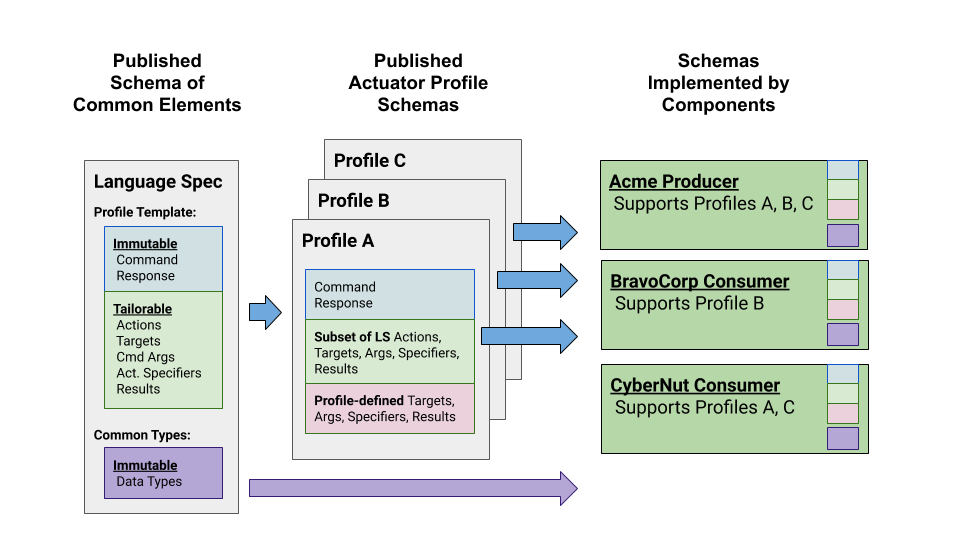

# Creating an OpenC2 Actuator Profile
## 1. Introduction
* The **OpenC2 Language Specification** provides the semantics for the essential elements
of the language, the structure for Commands and Responses, and the schema that defines the
proper syntax for the language elements that represents the Command or Response.
* **OpenC2 Actuator Profiles** specify the subset of the OpenC2 language relevant in the
context of specific Actuator functions. Actuator profiles extend the language by defining
Specifiers that identify the Actuator to the required level of precision. Actuator Profiles
may define Command Arguments and Targets that are relevant and/or unique to those Actuator functions.
* **Cyber-defense Components**, devices, systems and/or instances may (in fact are likely to)
implement multiple Actuator Profiles.

## 2. Schema Template